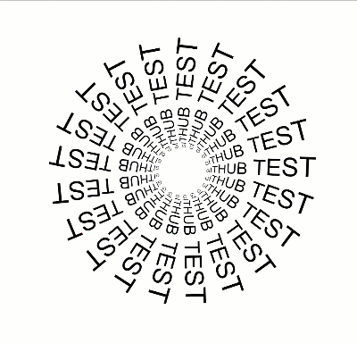

# circleText

Write your text to url (next to '/?txt=') and press ENTER key to play

_You can use '+' for spaces_

Example url: [http://berkkaraal.com/circleText/?txt=GITHUB+TEST](http://berkkaraal.com/circleText/?txt=GITHUB+TEST)

Example program 

----

_Note:_ If your circle doesn't fit the screen then zoom out and refresh the page

I used [p5.js](http://p5js.org) for this project
